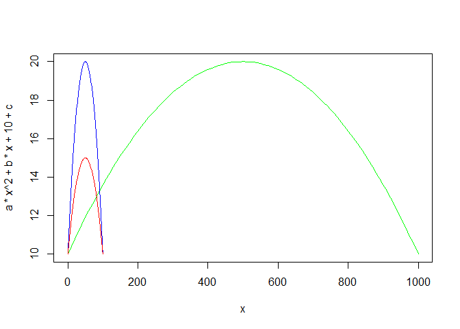

Canion
================
Galileo Cappella
July 6, 2018

R Markdown
----------

This is an R Markdown document. Markdown is a simple formatting syntax for authoring HTML, PDF, and MS Word documents. For more details on using R Markdown see <http://rmarkdown.rstudio.com>.

When you click the **Knit** button a document will be generated that includes both content as well as the output of any embedded R code chunks within the document. You can embed an R code chunk like this:

``` r
summary(cars)
```

    ##      speed           dist       
    ##  Min.   : 4.0   Min.   :  2.00  
    ##  1st Qu.:12.0   1st Qu.: 26.00  
    ##  Median :15.0   Median : 36.00  
    ##  Mean   :15.4   Mean   : 42.98  
    ##  3rd Qu.:19.0   3rd Qu.: 56.00  
    ##  Max.   :25.0   Max.   :120.00

Including Plots
---------------

You can also embed plots, for example:


Note that the `echo = FALSE` parameter was added to the code chunk to prevent printing of the R code that generated the plot.

``` r
tiro <- function(d,h, col, add = TRUE){
  a <- -h/(d/2)^2 
  b <- 4*h/d
  c <- h+a*(d/2)^2
  
  curve(a*x^2+b*x+10+c, from = 0, to = d, add = add, col = col)
}
tiro(1000,10, "green", FALSE)
tiro(100,10, "blue")
tiro(100,5, "red")
```


